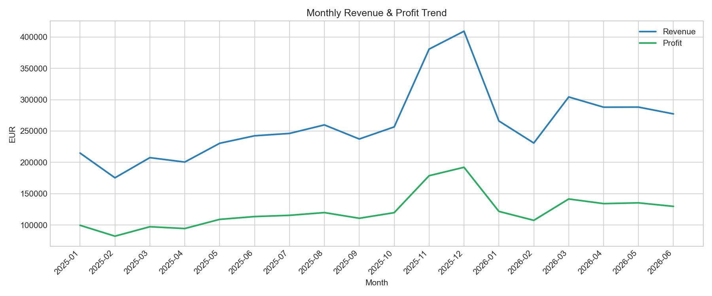
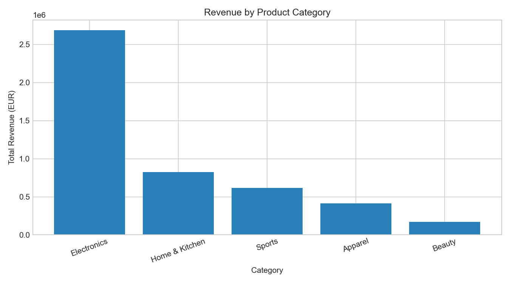
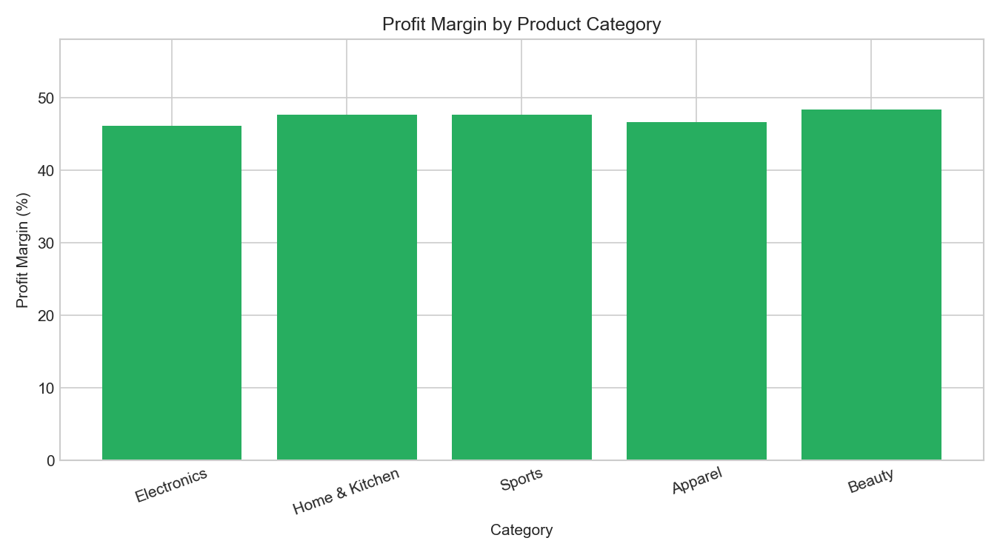
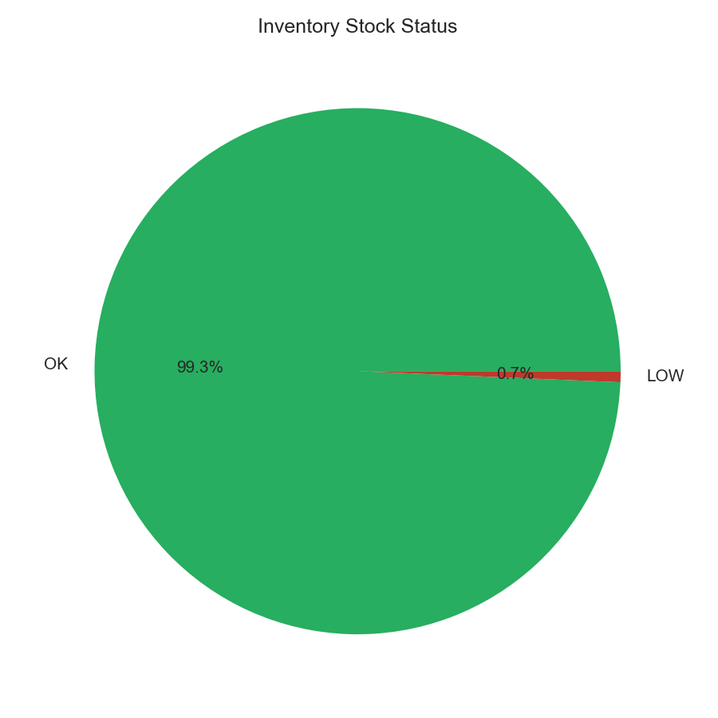

# Retail Sales & Inventory Analytics

Sales performance and inventory risk analysis for a multi-category retail business -- built with SQL, Python, and Power BI.

## Overview

This project analyzes 271K+ sales transactions across 800 products and 3.5 years to answer the questions a retail analyst is asked daily: what is driving revenue, which products lead each category, and what is at risk of stocking out?

## Key Findings

- Electronics is the top revenue category at ~EUR 2.69M, followed by Home & Kitchen and Sports
- Profit margins are consistent across categories (~46-48%), suggesting pricing strategy is applied uniformly rather than category-specific
- Monthly revenue trend shows clear seasonality, with a spike in Nov-Dec consistent with holiday shopping patterns
- 71 products are flagged LOW stock -- below their 2-week reorder point based on trailing average daily sales
- Top 3 products per category ranked by revenue, useful for merchandising and restock prioritization

## Charts

## Project Structure

    data/          products.csv, sales.csv, inventory.csv, generate_data.py
    sql/           revenue, category, top products (RANK window fn), low-stock, load_db.py, run_all_queries.py, make_charts.py
    outputs/       query result CSVs + chart images (outputs/charts/)

## How to Run

    python3 sql/load_db.py
    python3 sql/run_all_queries.py
    python3 sql/make_charts.py

## Methodology Notes

Reorder point is calculated as 2 weeks of coverage based on each product's trailing average daily sales rate. Top products by category uses RANK() OVER (PARTITION BY category ORDER BY revenue DESC) to rank products within their own category rather than globally, so smaller categories still surface their top performers. Sales volume reflects realistic weekday/weekend demand variation, a growth trend over time, and a holiday-season (Nov-Dec) spike.

## Tech Stack

SQL (SQLite, window functions) - Python (Pandas, NumPy) - Power BI - Excel
